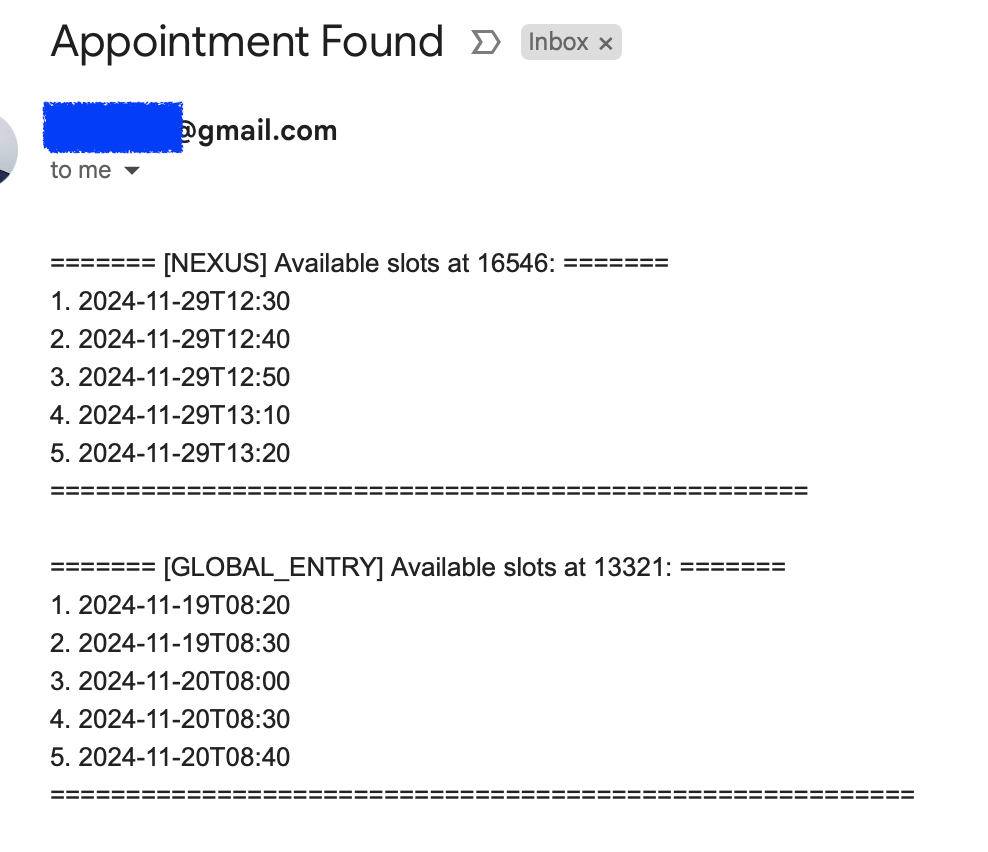
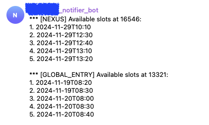

# Nexus and Global Entry Appointment Notifier

---

## Overview

Are you frustrated with trying to book a Global Entry or Nexus appointment? Do you struggle to find available slots for the dates you want? Or perhaps you don’t want to pay a third-party service to provide you with appointment availability? Maybe you’ve even noticed that the paid services or apps you’ve used fail to deliver timely notifications, causing you to miss booking opportunities.

With this tool, you no longer need to worry about any of that—it’s completely free and designed to provide real-time updates, ensuring you don’t miss a chance to secure your appointment!

This project monitors appointment availability for Nexus and Global Entry enrollment centers. It provides real-time notifications via **email** and **Telegram** when slots become available.

---

## Features

- **Customizable Monitoring**: Configure the program to check specific locations and dates.
- **Notifications**:
  - **Email** notifications using Gmail.
  - **Telegram** notifications to a specified chat.
- **Dynamic Configuration**:
  - Monitor multiple programs (e.g., Nexus, Global Entry).
  - Limit the number of results or specify a date range.
- **Location Management**:
  - Extract and maintain a JSON file of all enrollment center locations for easy reference.

---

## Prerequisites

1. **Python Environment**:
   - Python 3.8 or newer.
   - Virtual environment for dependency isolation.

2. **APIs and Accounts**:
   - **Gmail**:
     - App-specific password for secure email sending.
   - **Telegram**:
     - Bot token and chat ID for message delivery.

---

## Project Structure

```plaintext
nexus-ge-appointment-notifier/
├── notifier/                     # Core application logic
│   ├── __init__.py
│   ├── monitor.py                # Appointment monitoring logic
│   ├── notifier.py               # Notification logic (email & Telegram)
│   ├── extract_locations.py      # Location extraction logic
├── main.py                       # Entry point for running the application
├── config.json                   # Configuration file
├── locations.json                # JSON file with all enrollment center locations
├── requirements.txt              # Python dependencies
├── .env                          # Environment variables (for email & Telegram credentials)
├── README.md                     # Documentation
├── appointment.log               # Log file for monitoring activities
```

---

## Setup Instructions

### 1. Clone the Repository
```bash
git clone https://github.com/willhcw/nexus-ge-appointment-notifier.git
cd nexus-ge-appointment-notifier
```

### 2. Set Up Virtual Environment
```bash
python3 -m venv venv
source venv/bin/activate   # On Windows: venv\Scripts\activate
pip install -r requirements.txt
```

### 3. Configure Email Notifications
1. Log in to your Gmail account and create an **App Password**:
   - Go to **Google Account > Security > App Passwords**.
   - Generate a new password for "Mail".
   - Note the generated password.

2. Add your email credentials to a `.env` file in the root directory:
   ```plaintext
   EMAIL_ADDRESS=your-email@gmail.com
   EMAIL_PASSWORD=your-app-password
   TO_EMAIL=recipient-email@gmail.com
   ```

### 4. Configure Telegram Notifications
1. **Create a Telegram Bot**:
   - Open Telegram and search for `@BotFather`.
   - Use the command `/newbot` to create a new bot.
   - Follow the instructions and copy the **Bot Token** provided by `@BotFather`.

2. **Add the Bot to a Chat**:
   - Open a chat with your bot or create a group and add the bot to the group.
   - Send a message to the bot (or in the group where the bot is added).

3. **Get the Chat ID**:
   - Use the following API call to retrieve updates and identify your chat ID:
     ```bash
     curl -s "https://api.telegram.org/bot<your-bot-token>/getUpdates"
     ```
   - Replace `<your-bot-token>` with the token you received from `@BotFather`.
   - Check the JSON response for `"chat"` and note the `id` value.

4. **Add Telegram Credentials to `.env` File**:
   - Update your `.env` file with the following:
     ```plaintext
     TELEGRAM_BOT_TOKEN=your-bot-token
     TELEGRAM_CHAT_ID=your-chat-id
     ```

### 5. Extract Locations
Run the `extract_locations.py` script to fetch and save enrollment center details:
```bash
python notifier/extract_locations.py
```

This will create or update the `locations.json` file, which contains all available enrollment centers with their `name` and `id`.

### 6. Update Configuration
Use `locations.json` to find the desired enrollment centers and update the `config.json` file accordingly.

#### Explanation of `config.json`
The `config.json` file controls how the program behaves. Below is a detailed explanation of each field:

| **Field**         | **Type**    | **Description**                                                                 |
|--------------------|-------------|---------------------------------------------------------------------------------|
| `programs`        | List        | List of programs to monitor (e.g., `nexus`, `global_entry`).                    |
| `locations`       | Dictionary  | Maps programs to lists of location IDs (use `locations.json` for reference).    |
| `check_interval`  | List        | Two integers specifying the range of seconds to wait between checks (e.g., `[10, 20]`). |
| `notifications`   | Dictionary  | Enable/disable notifications via email and Telegram (e.g., `"email": true`).    |
| `limit`           | Integer     | Maximum number of results to fetch.                                             |
| `start_date`      | String      | (Optional) Start date in `YYYY-MM-DD` format.                                   |
| `end_date`        | String      | (Optional) End date in `YYYY-MM-DD` format.                                     |

---

## Why Use `check_interval`?

The `check_interval` prevents excessive requests to the government servers, avoiding potential **DDoS-like behavior** and ensuring your IP address isn’t blocked. This range ensures the tool behaves responsibly while still checking frequently enough to catch new appointments.

---

## Important Notes on `start_date` and `end_date`

- **Optional Fields**:
  - If both `start_date` and `end_date` are empty (`""`), the script will fetch the soonest available slots.
  - If only `start_date` is provided, `end_date` will default to `start_date` at `23:59:59`.
  - Both fields must use the `YYYY-MM-DD` format if specified.

---

## Example `config.json`

```json
{
    "programs": ["nexus", "global_entry"],
    "locations": {
        "nexus": [5020],
        "global_entry": [13321]
    },
    "check_interval": [10, 20],
    "notifications": {
        "email": true,
        "telegram": true
    },
    "limit": 5,
    "start_date": "",
    "end_date": ""
}
```

---

## 7. Start Monitoring
Run the main script to monitor appointments:
```bash
python main.py
```

### Log Output
- Appointment logs are saved in `appointment.log` for review.
- Enable debug mode in `main.py` to view detailed logs:
  ```python
  debug_enabled = True
  ```

---

## Expected Notifications

Once configured correctly, you will receive notifications when slots are available:

- **Email Notification**:
  

- **Telegram Notification**:

  

---

## Dependencies

All dependencies are listed in `requirements.txt`. Install them using:
```bash
pip install -r requirements.txt
```

Key libraries:
- `requests`: For API requests.
- `smtplib`: For sending emails.
- `dotenv`: For managing environment variables.

---

## Troubleshooting

1. **Email Issues**:
   - Ensure `EMAIL_ADDRESS` and `EMAIL_PASSWORD` are correct.
   - Check if Gmail's "Allow less secure apps" is disabled (should not be needed with app passwords).

2. **Telegram Issues**:
   - Ensure the bot token and chat ID are correct.
   - Verify the bot is added to the chat.

3. **No Appointments Found**:
   - Verify location IDs in `config.json`.
   - Check if the API returns valid data using:
     ```bash
     curl -s "https://ttp.cbp.dhs.gov/schedulerapi/slots"
     ```

---

## License

This project is licensed under the [MIT License](LICENSE).
